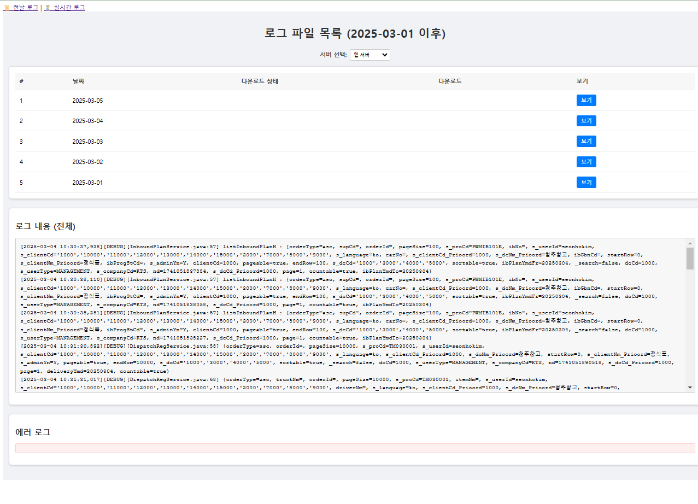
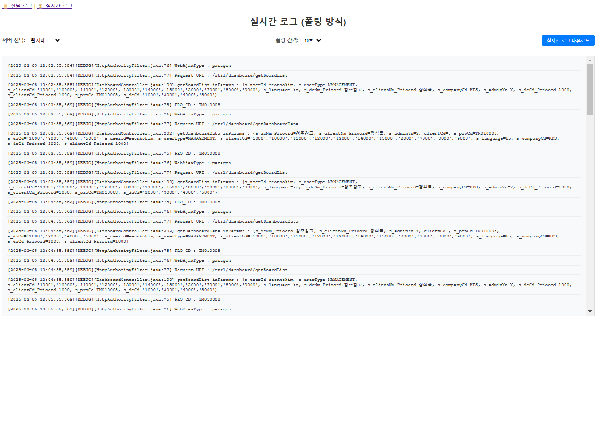

# MyProjectGetDailyLogs

MyProjectGetDailyLogs는 **웹 서버**와 **배송기사앱 서버** 두 종류의 서버에서 로그 파일을 가져와 관리할 수 있는 로그 관리 시스템입니다.  
이 프로젝트는 **Java 17**과 **Gradle**을 사용하여 빌드되었으며, Spring Boot 백엔드와 Vue.js 프론트엔드로 구성되어 있습니다.

---

## 기술 스택

- **Backend:**
  - Java 17
  - Spring Boot
  - Gradle
  - JSch (SSH 연결)
  - Reactor (WebFlux 기반 실시간 스트리밍)
  - 기타 Spring 관련 라이브러리 (Spring Web, Spring Core 등)

- **Frontend:**
  - Vue.js 3 (Composition API)
  - Axios
  - Vite (빌드 도구)
  - Moment.js (날짜/시간 처리)

---

## 주요 기능

### 백엔드 (Spring Boot)
- **SSH 연동:**  
  JSch를 사용하여 원격 서버에 SSH로 접속, 로그 파일에서 필요한 로그를 추출합니다.
- **로그 다운로드 및 저장:**  
  웹 서버와 배송기사앱 서버의 로그 파일 경로를 별도로 관리하며, 다운로드 받은 로그는 로컬의 지정된 폴더(`logs/web` 또는 `logs/deliveryapp`)에 저장됩니다.
- **실시간 로그 스트리밍 & 폴링:**  
  실시간 로그를 스트리밍(SSE 방식)하거나 폴링 방식으로 최근 로그(예: 최근 100줄)를 가져옵니다.
- **파일 존재 여부 확인:**  
  지정 날짜의 로그 파일이 이미 다운로드되어 있는지 확인하여 다운로드 상태를 관리합니다.
- **API 엔드포인트:**
  - `GET /api/logs`: 특정 날짜와 서버 타입의 로그 내용을 반환합니다.
  - `GET /api/logs/poll`: 폴링 방식으로 최근 로그(예: 원격 로그 파일의 최근 100줄)를 문자열로 반환합니다.
  - `GET /api/logs/downloadFile`: 특정 날짜와 서버 타입의 로그 파일을 다운로드합니다.
  - `GET /api/logs/fileStatus`: 로그 파일의 존재 여부를 확인하여 `{ "exists": true }` 또는 `{ "exists": false }` 형태로 반환합니다.

### 프론트엔드 (Vue.js)
- **로그 파일 목록:**  
  2025-03-01부터 오늘까지의 날짜별 로그 파일 목록을 테이블 형식으로 표시하며, 각 날짜의 다운로드 상태("X" 또는 빈 값)를 보여줍니다.
- **서버 선택:**  
  "웹 서버"와 "배송기사앱" 중 하나를 선택하여 해당 서버의 로그를 조회, 다운로드 및 보기를 수행할 수 있습니다.
- **폴링 간격 설정:**  
  사용자가 5초, 10초, 30초 중 원하는 폴링 간격을 선택할 수 있습니다.
- **실시간 로그 폴링:**  
  선택된 간격에 따라 백엔드의 폴링 API를 호출하여 로그를 갱신하며, 최대 100줄까지 저장됩니다.
- **실시간 로그 다운로드:**  
  현재까지 수집된 실시간 로그를 하나의 텍스트 파일로 생성하여 사용자의 기본 다운로드 폴더로 저장할 수 있습니다.
- **에러 로그 필터링:**  
  전체 로그 내용 중 에러나 예외 로그만 별도로 추출하여 표시합니다.
- **모던한 UI 디자인:**  
  카드 스타일, 옵션 패널, 테이블 등 세련되고 직관적인 디자인이 적용되어 있습니다.

---

## 설치 및 실행 방법

### 백엔드 설정

#### 1. 필수 사항
- **Java 17**
- **Gradle**

#### 2. 저장소 클론 및 프로젝트 디렉토리 이동
```bash
git clone <repository-url>
cd MyProjectGetDailyLogs/backend
```


> **이미지 1: 애플리케이션 날짜별 로그**  
> 
>
> **이미지 2: 실시간 서버 로그**  
> 
